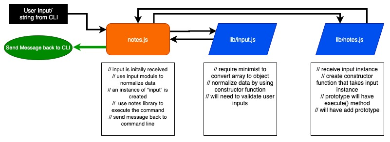

# LAB - Class 03

## Project: Notesy

### Author: Davee Sok

### Links and Resources

- [Lab 2 Pull Request](https://github.com/davee-401-advanced-javascript/notes/pull/2)
- [Lab 3 Pull Request](https://github.com/davee-401-advanced-javascript/notes/pull/3)
- [ci/cd](https://github.com/davee-401-advanced-javascript/notes/actions) (GitHub Actions)
<!-- - [back-end server url](http://xyz.com) (when applicable)
- [front-end application](http://xyz.com) (when applicable) -->

### Setup

<!-- i.e.
- `PORT` - Port Number
- `MONGODB_URI` - URL to the running mongo instance/db -->

- Make sure node and mongo is installed on your computer and working.
- Clone this Repository on to your local computer
- CD into this Repository
- Do an `npm install` in the command Line

#### `.env` Requirements

- Create .env file and enter the following code to connect database (for MAC USERS):
- `MONGODB_URI = 'mongodb://localhost:27017/notesyDB'`

#### How to initialize/run this application

<!-- - e.g. `npm start` -->

- CD into repository
- Will need to create a Database inside Mongo called "notesyDB"
- Get into mongo by typing "mongo" in command line (for MAC USERS)
- Create a DB called notesyDB by entering: `use notesyDB`.

#### How to use this Application

- In terminal: type node index.js followed by commands.
- Valid commands are: --add -a --delete -d --list -l followed by description using quotation marks.
- Example:
  - `node index.js --add "pickup milk" --category "grocery"`
  - `node index.js -a "drop billy at soccer practice" --category "kids"`
  - `node index.js --list`
  - `node notes.js --delete 5eab650143bfc84e595b8eaa`

#### Tests

<!-- - How do you run tests?
- Any tests of note?
- Describe any tests that you did not complete, skipped, etc -->

To run test:

- CD into your repo
- In the command line enter: `npm test`

#### UML

Link to an image of the UML for your application and response to events

